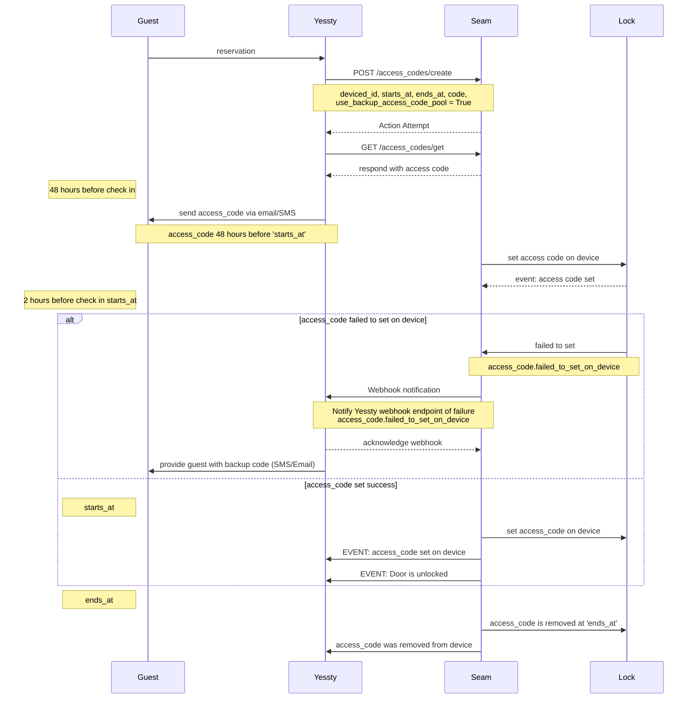

# Getting started with Seam

Seam builds digital and physical infrastructure that enables software developers and businesses to connect their applications with the IoT devices to orchestrate their use and make sense of the physical world around us.

This short guide provides a simple demo showcasing how to control smart locks and access codes for property management software (PMS) using the Seam API. Seam greatly simplifies the integration process with each brand of smart locks. 

Specifically we'll use Seam to issue unique smart lock access codes for each guest. This access code is then communicated to the Airbnb guest for them to enter the house. Importantly, this access code should only become active at the check-in time for the reservation and then become inactive at the check-out time. Bob also has to send this access code to the guest 48 hours before check-in time.


1. Create a Seam account at https://console.seam.co See quickstart guide
3. in your Sandbox Workspace create a test device. In this example we'll use a Yale lock and the test credentials provided in the Seam Console

## Example request diagram

* The reservation information arriving from the guest/airbnb to the Yessty’s server
* Yessty’s server programming an access code via Seam onto the smart lock
* Yessty’s server sending this access code to the guest via email & sms 48 hours prior to the check-in




## Code sample


* Importing and setting the Seam API key
* Issuing each request that matches the above request diagram
* “//... later on” comments in between requests
* Show the exact API routes being used [Seam API endpoints](https://docs.seam.co/latest/api-clients/overview)
* Show the important parameters being provided to the Seam API
* Show some of the side-effects of making API calls to Seam (e.g. Seam programming the code onto the device)
* Nice code sample formatting, including comments to help the customer understand the purpose of each item.


Creating an access code with Seam


## Managing backup codes with Seam

Unfortunately, access codes can sometimes fail to program onto a smart lock. For example, the wifi network could be down. As a result, Seam is unable to communicate with the lock to program the access code.

An access code that failed to program can lead to a pretty unhappy Airbnb guest who, once at the front door, tries to enter the access code that the PMS sent them to no avail.

In order to avoid this situation, Seam not only provides webhook events indicating when Seam is unable to program an access code (access_code.failed_to_set_on_device) but also provides backup codes that are permanently on a lock and can be used as an emergency access solution.

We'll implement this backup code logic in order to have a reliable access solution in case the primary access code fails to program. When a backup code is used, the PMS must immediately email the guest to tell them to use the new backup code.

Our request diagram shows the following:
* A webhook event coming from Seam 2 hours before the check-in time indicating the code has failed to program.
* Yessty server acknowledging the webhook and immediately issuing a request to Seam to request the backup code
* Yesstly server then sends the backup code to the guest to let them know to use that instead.


## Notes

### Dummy data 
```
Guest name: “Jane Doe”
Guest email: “jane@example.com”
Reservation check-in: 4pm, January 8th, 2024
Reservation check-out: 12pm, January 12th, 2024
 Guest telephone number: "650-394-3042" 
Listing Name: “123 Main St”
Listing Smart Lock ID: “abc-1234”
```

[Seam capability guide for smart locks](https://docs.seam.co/latest/capability-guides/smart-locks)

Understand the lifecycle of access codes. Side effects of Seam API
* [Create access codes](https://docs.seam.co/latest/capability-guides/smart-locks/access-codes/creating-access-codes)

* [Set backup codes](https://docs.seam.co/latest/capability-guides/smart-locks/access-codes/backup-access-codes)

* [`Events and webhooks`](https://docs.seam.co/latest/api-clients/events)
Svix docs https://docs.svix.com/

When you request for a device to perform an action, the Seam API will immediately return an Action Attempt object. In the background, the Seam API will perform the action. This Action Attempt allows you to keep track of the progress of your Action.

### Events


`access_code.created` | An access_code has been created.

`access_code.changed` | An access_code status or property has changed.

`access_code.set_on_device` | 	An access_code has been programmed onto a device.

`access_code.failed_to_set_on_device event` | An error occurred in trying to program the code onto a device. This indicates a failure occurred but the failure might be temporary and may recover (in which case an access_code.set_on_device event will be sent).