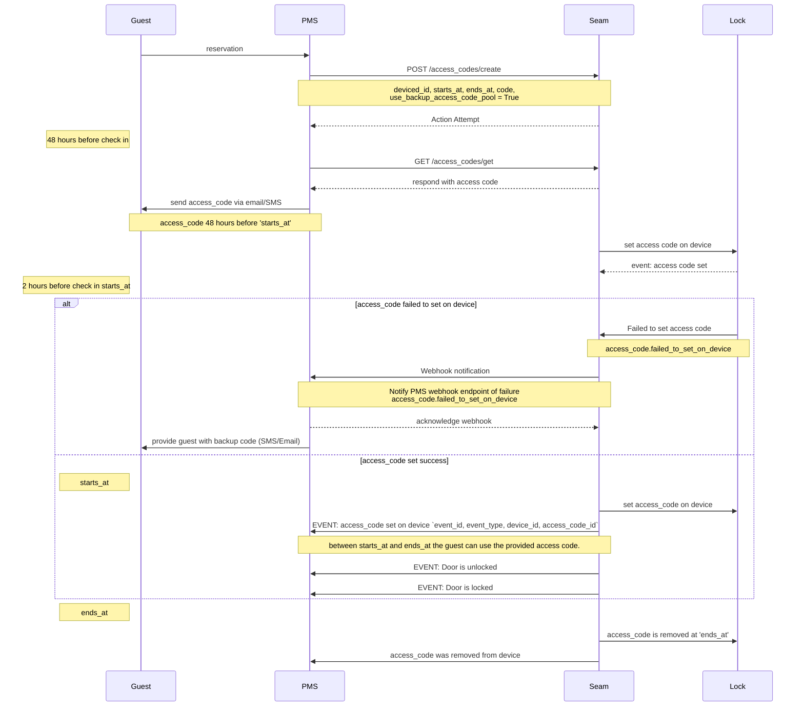

# Getting started with Seam

> Seam builds digital and physical infrastructure that enables software developers and businesses to connect their applications with the IoT devices to orchestrate their use and make sense of the physical world around us.

This short guide provides a simple demo showcasing how to control smart locks and access codes for property management software (PMS) using the Seam API. Seam greatly simplifies the integration process with each brand of smart locks. 

We'll use Seam to issue unique smart lock access codes for each guest. This access code is then communicated to the guest for them to enter the house. Importantly, this access code should only become active at the check-in time for the reservation and then become inactive at the check-out time. We will send this access code to the guest 48 hours before check-in time.

**Step 1**. Create a Seam account at https://console.seam.co (See [quickstart guide](https://docs.seam.co/latest/quickstart))

**Step 2**. In your sandbox workspace create test devices using sample data and credentials.

Seam allows you to test your device integration without needing any physical devices using a [Sandbox environment](https://docs.seam.co/latest/developer-tools/sandbox-and-sample-data)

> Workspaces are the top-level resource in the Seam ecosystem. They encapsulate all other resources, such as devices, events, and connected third-party accounts.

**Step 3** Go to https://cli.seam.co/ and run `seam` to get started with the online CLI or install the Seam SDK in your preferred language.

Our fake guest and reservation data can be found in `reservation.json`    

```json
{
  "guest_name": "Jane Doe",
  "guest_email": "jane@example.com",
  "guest_telephone": "+1 650-394-3042",
  "reservation_check_in": "01/08/24 16:00:00",
  "reservation_check_out": "01/12/24 12:00:00",
  "listing_name": "123 Main St",
  "listing_smart_lock_id": "abc-1234"
}
```

## Example request diagram

* The reservation information arriving from the guest/airbnb to the PMS server
* PMS server programming an access code via Seam onto the smart lock
* PMS server sending this access code to the guest via email & SMS 48 hours prior to the check-in (e.g. using Twilio)
* A webhook event coming from Seam 2 hours before the check-in time indicating the code has failed to program.
* PMS server acknowledging the webhook and immediately issuing a request to Seam to request the backup code
* PMS server then sends the backup code to the guest to let them know to use that instead.




## Code samples

### Creating an access code with Seam


```python
from seamapi import Seam

# export SEAM_API_KEY=***
seam = Seam()

y_lock = seam.locks.list()[0]

```

* Importing and setting the Seam API key
* Issuing each request that matches the above request diagram
* Show the exact API routes being used [Seam API endpoints](https://docs.seam.co/latest/api-clients/overview)
* Show the important parameters being provided to the Seam API
* Show some of the side-effects of making API calls to Seam (e.g. Seam programming the code onto the device)


## Concepts

### Device and System Capabilites
> Each device that you connect to Seam has a specific set of capabilities. These capabilities define the Seam API actions that you can use. For example, some devices support remote unlock actions, while others support programming access codes. Some devices support both of these capabilities. When developing your application, it is imperative to be able to identify the capabilities of each device.


## Managing backup codes with Seam

Unfortunately, access codes can sometimes fail to program onto a smart lock. For example, the wifi network could be down. As a result, Seam is unable to communicate with the lock to program the access code.

An access code that failed to program can lead to a pretty unhappy Airbnb guest who, once at the front door, tries to enter the access code that the PMS sent them to no avail.

In order to avoid this situation, Seam not only provides webhook events indicating when Seam is unable to program an access code (access_code.failed_to_set_on_device) but also provides backup codes that are permanently on a lock and can be used as an emergency access solution.

We'll implement this backup code logic in order to have a reliable access solution in case the primary access code fails to program. When a backup code is used, the PMS must immediately email the guest to tell them to use the new backup code.


[Seam capability guide for smart locks](https://docs.seam.co/latest/capability-guides/smart-locks)
* [Create access codes](https://docs.seam.co/latest/capability-guides/smart-locks/access-codes/creating-access-codes)
* [Set backup codes](https://docs.seam.co/latest/capability-guides/smart-locks/access-codes/backup-access-codes)
* [`Events and webhooks`](https://docs.seam.co/latest/api-clients/events)


### Action attempts
> When you request for a device to perform an action, the Seam API will immediately return an Action Attempt object. In the background, the Seam API will perform the action. This Action Attempt allows you to keep track of the progress of your Action.

### Events

> Events are our way of letting you know when something interesting happens in your workspace. When an interesting event occurs, we create a new Event object. For example, when a lock is unlocked, we create a lock.unlocked event; and when a device's battery level is low, we create a device.battery_low event.

`access_code.created` | An access_code has been created.

`access_code.changed` | An access_code status or property has changed.

`access_code.set_on_device` | 	An access_code has been programmed onto a device.

`access_code.failed_to_set_on_device event` | An error occurred in trying to program the code onto a device. This indicates a failure occurred but the failure might be temporary and may recover (in which case an access_code.set_on_device event will be sent).

### Backup access codes

A backup access code pool is a collection of pre-programmed access codes stored on a device, ready for use. These codes are programmed in addition to the regular access codes on Seam, serving as a safety net for any issues with the primary codes. If there's ever a complication with a primary access code—be it due to intermittent connectivity, manual removal from a device, or provider outages—a backup code can be retrieved. Its end time can then be adjusted to align with the original code, facilitating seamless and uninterrupted access.

To bulletproof your implementation of access codes, it's essential to maintain a pool of backup access codes for each device. Seam provides a robust implementation of this backup pool system, and this article will help you learn how to use our backup access pool system.

To confirm that Seam supports back up code pools for your device, check the device's properties by inspecting the response from Get Device or List Devices.
Ensure that the device's `properties.supports_backup_access_code_pool` is true.
`is_backup_access_code_available`

# Notes on Seam

[Designing an API for the physical world - Web of Things meetup, Sy Bohy](https://www.youtube.com/watch?v=LHybkrb3Xek&t=1378s)
- This was a very useful video and perhaps should be redone for your own marketing and sales material.
    
[Hackster Cafe interview with Dawn Ho](https://www.youtube.com/watch?v=nFWyUIYJA0E)
- NB the change of direction in the [Bridge](https://www.seam.co/seam-bridge) product. How did customers influence this?

NB #feedback in Firefox 126.0b9 console.seam.co status light requires a browser refresh to update traffic light status.
NB #feedback The documentation is thorough and clear to follow. More video content could be useful.

TODO #feedback Intercom onboarding emails. Formatting of code, links to specific API docs pages and demos, include video and image demos e.g. asciinema, carbon
TODO # feeback some example repos + blog posts providing a lightweight PMS demo. Twilio, Stripe, Plaid offers some good examples:
- [Plaid Pattern repo](https://github.com/plaid/pattern) 
- [Twilio Demo repos](https://github.com/search?q=org%3Atwilio+demo&type=repositories)
