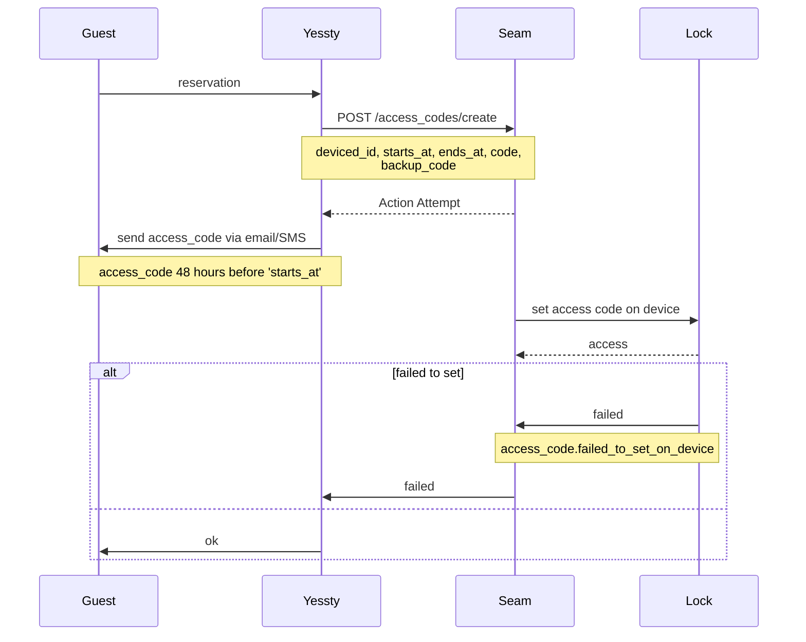

```mermaid
sequenceDiagram
    participant Guest
    participant Yessty
    participant Seam 
    participant Lock
    Guest->>Yessty: reservation
    Yessty->>Seam: POST /access_codes/create
    Note over Yessty,Seam: deviced_id, starts_at, ends_at, code, <br/> backup_code
    Seam-->>Yessty: Action Attempt
    Yessty->>Guest: send access_code via email/SMS
    Note over Guest,Yessty: access_code 48 hours before 'starts_at'
    Seam->>Lock: set access code on device
    Lock-->>Seam: access
    alt failed to set
        Lock->>Seam: failed
        Note over Seam,Lock: access_code.failed_to_set_on_device
        Seam->>Yessty: failed
    else
        Yessty->>Guest: ok
    end
```