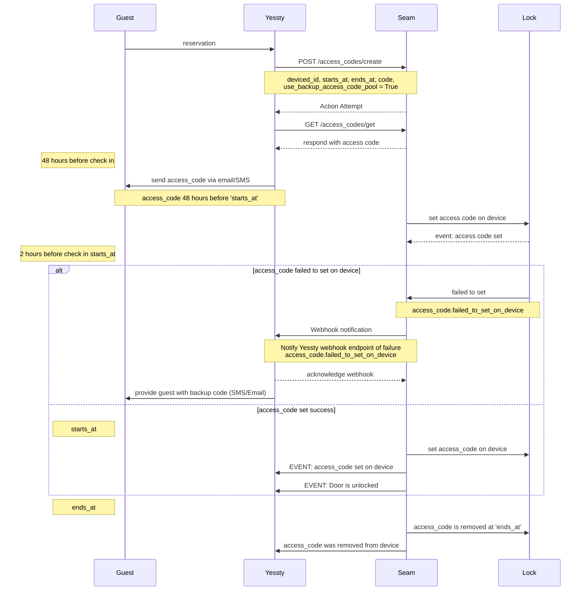

```mermaid
sequenceDiagram
    participant Guest
    participant Yessty
    participant Seam 
    participant Lock

    Guest->>Yessty: reservation
    Yessty->>Seam: POST /access_codes/create

    Note over Yessty,Seam: deviced_id, starts_at, ends_at, code, <br/> use_backup_access_code_pool = True
    Seam-->>Yessty: Action Attempt
    Yessty->>Seam: GET /access_codes/get
    Seam-->>Yessty: respond with access code

    %% Yessty provides their guest with access code
    Note left of Guest: 48 hours before check in
    Yessty->>Guest: send access_code via email/SMS
    Note over Guest,Yessty: access_code 48 hours before 'starts_at'
    Seam->>Lock: set access code on device
    Lock-->>Seam: event: access code set

    %% if Yessty recieves webhook
    Note left of Guest: 2 hours before check in starts_at
    alt access_code failed to set on device
        Lock->>Seam: failed to set
        Note over Seam,Lock: access_code.failed_to_set_on_device
        Seam->>Yessty: Webhook notification
        Note over Yessty,Seam: Notify Yessty webhook endpoint of failure <br/> access_code.failed_to_set_on_device
        Yessty-->>Seam: acknowledge webhook 
        Yessty->>Guest: provide guest with backup code (SMS/Email)

    else access_code set success
        Note left of Guest: starts_at
        Seam->>Lock: set access_code on device
        Seam->>Yessty: EVENT: access_code set on device
        Seam->>Yessty: EVENT: Door is unlocked

    end
    Note left of Guest: ends_at
    Seam->>Lock: access_code is removed at 'ends_at'
    Seam->>Yessty: access_code was removed from device
```